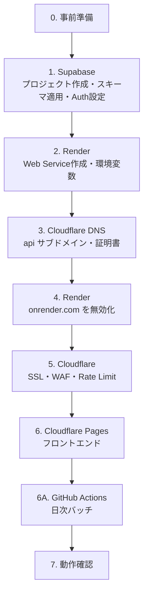

# デプロイ手順書（GUI作業）

本番環境を初めて構築するときの手順を、実施する順番に並べたものです。各サービスのダッシュボードの画面名・メニュー名は変更されることがあるため、見つからない場合は近い名前の項目を探してください。

| 役割 | サービス | 本番のURL |
|---|---|---|
| フロントエンド（静的サイト） | Cloudflare Pages | `https://isobath.jocarium.productions` |
| API | Render（Web Service、Free） | `https://api.isobath.jocarium.productions` |
| 認証・データベース | Supabase | `https://<project-ref>.supabase.co` |
| DNS・WAF・Rate Limit | Cloudflare（`jocarium.productions` のゾーン） | — |
| 日次バッチ（海図の更新、毎日 01:00 JST） | GitHub Actions（`.github/workflows/nightly.yml`） | — |

---

## 0. 全体の流れ



順番の理由：

- API の `ALLOWED_ORIGINS` とフロントエンドの `PUBLIC_API_BASE` はお互いのURLを使いますが、どちらもドメインを事前に決めてあるため、先に設定できます。
- Render の独自ドメインの証明書は、Cloudflare のプロキシを**オフ**にした状態で発行する必要があるため、手順3→4→5の順に進めます。
- Supabase の Auth には、フロントエンドのURL（リダイレクト先）を最初から登録しておきます。

---

## 0. 事前準備

- [ ] **公開文書の【要記入】【要確定】【要法務確認】をすべて確定する。** 未確定のままデプロイしない（[policies/README.md](policies/README.md)）
- [ ] 本番用の質問項目を確定する。ローカルの `supabase/seed.sql` のダミー項目は本番には入らない。本番の項目は `app/items/items-*.csv` に書いてマージすると、日次バッチの後に `python -m isobath.items` が `isobath_batch` で投入する（FR-OPS-01）
- [ ] GitHub リポジトリ（`kokimiza/isobath`）に `main` を push 済みであること
- [ ] Supabase のリージョンを決める（推奨：Tokyo）
- [ ] Render のリージョンを決める（日本に最も近いのは Singapore）
- [ ] 本番用の送信メールサーバ（SMTP）を用意する。Supabase 標準のメール送信は、送信先・送信数が制限されており本番には使えない
- [ ] 次の秘密値を生成し、パスワードマネージャに保存する

```sh
# isobath_api / isobath_pipeline / isobath_batch のDBパスワード、LOG_SALT をそれぞれ生成
python -c "import secrets; print(secrets.token_urlsafe(32))"
```

---

## 1. Supabase

### 1-1. プロジェクトの作成（GUI）

1. Supabase ダッシュボード → **New project**
2. Name：`isobath`、Region：事前準備で決めたもの、Database password：強いものを生成して保存
3. 作成後、**Project Settings → General** で `Reference ID`（`<project-ref>`）を控える

### 1-2. スキーマの適用（CLI）

スキーマはGUIではなく、リポジトリのマイグレーションから適用します。

```sh
pnpm exec supabase login
pnpm exec supabase link --project-ref <project-ref>
pnpm exec supabase db push
```

> ⚠ `db push --include-seed` は**絶対に使わない**。`seed.sql` にはダミー項目と開発用テストユーザー（foo / bar）が含まれている。

スキーマを適用しないまま API を動かすと、`relation "app.consent_state" does not exist` などで 500 になります。

既存環境の更新時も、未適用のマイグレーションを確認して適用してください。`20260922010000_backfill_profiles.sql` は、スキーマ導入前に登録されたユーザーの不足プロフィールを補完します。これが未適用だと、同意保存時に `profile not found`（500）が発生します。既存の観測点番号・仮名ID・同意記録は保持され、研究への同意が自動追加されることもありません。

```sh
pnpm db:plan
pnpm db:push
```

フロントエンドの更新だけではこのDB不整合は解消しません。適用後、既存アカウントで「海図 → 質問に回答する → 参加への同意 → 初回測深」へ進めることを確認してください。

### 1-3. DBロールのパスワード（GUI：SQL Editor）

3つのロールは 1-2 のマイグレーションが作ります。パスワードは設定されていないため、**SQL Editor** で実行します。

```sql
alter role isobath_api      login noinherit password '<生成したパスワード1>';
alter role isobath_pipeline login noinherit password '<生成したパスワード2>';
alter role isobath_batch    login noinherit password '<生成したパスワード3>';
```

> SQL Editor の実行履歴にパスワードが残るため、実行後にそのクエリを履歴から削除するか、`psql` から実行してください。

> `noinherit` は必ず付ける。マイグレーションは既存のロールを作り直さないため、先に手で `create role` したロールは既定の `inherit` のまま残る。`inherit` だと `isobath_api` が `set role authenticated` をしなくても `authenticated` の権限を持ってしまう（design D-2）。

### 1-4. Data API（GUI）

**Project Settings → Data API**（または API）→ **Exposed schemas**

- [ ] `public` と `graphql_public` だけであること。**`app` と `analysis` を追加しない**（design D-1：ブラウザからテーブルへ直接アクセスさせない）

### 1-5. JWT 署名鍵（GUI）

API は非対称鍵（ES256 / RS256）で署名されたJWTだけを受け付けます（design §5.4）。

1. **Project Settings → JWT Keys**
2. 旧来の共有シークレット（HS256）が使われている場合は、非対称鍵への移行を行い、ES256 の鍵を現在の鍵にする
3. 次のURLで `"alg":"ES256"`（または RS256）の鍵が返ることを確認する

```sh
curl https://<project-ref>.supabase.co/auth/v1/.well-known/jwks.json
```

### 1-6. Auth の設定（GUI）

**Authentication → URL Configuration**

| 項目 | 値 |
|---|---|
| Site URL | `https://isobath.jocarium.productions` |
| Redirect URLs | `https://isobath.jocarium.productions/auth/callback`<br>`https://isobath.jocarium.productions/en/auth/callback` |

**Authentication → Sign In / Providers → Email**

| 項目 | 値 |
|---|---|
| Enable email signups | ON |
| Confirm email | **ON**（requirements FR-ACC-02） |
| Minimum password length | 8 |

**Authentication → Emails → SMTP Settings**

- [ ] 事前準備で用意した SMTP を設定する。送信元アドレスは本サービスのドメインにする

**Authentication → Rate Limits**

- [ ] サインアップ・メール送信の上限を確認する。Signup は Cloudflare を通らないため、ここが唯一の Rate Limit になる（design D-7）

**Authentication → Attack Protection（CAPTCHA）**

- [ ] **まだ有効にしない。** フロントエンドに Turnstile のウィジェットが未実装のため、有効にすると登録ができなくなる

### 1-7. APIキーと接続文字列を控える（GUI）

| 控える値 | 場所 | 使い道 |
|---|---|---|
| Project URL（`https://<project-ref>.supabase.co`） | Project Settings → API | Render `SUPABASE_URL`、Pages `PUBLIC_SUPABASE_URL` |
| Publishable key（`sb_publishable_...`） | Project Settings → API Keys | Pages `PUBLIC_SUPABASE_PUBLISHABLE_KEY` |
| Transaction pooler の接続文字列（ポート 6543） | ダッシュボード上部の **Connect** → Transaction pooler | Render `DATABASE_URL`（ユーザーとパスワードを差し替える） |

> ⚠ Secret key（`sb_secret_...`）と service_role key は、Render にも Pages にも**設定しない**。

`DATABASE_URL` は、Connect 画面の Transaction pooler の文字列のユーザー名を `isobath_api.<project-ref>` に、パスワードを 1-3 で設定したものに置き換えます。

```text
postgresql://isobath_api.<project-ref>:<パスワード1>@aws-0-<region>.pooler.supabase.com:6543/postgres
```

| 確認点 | 正しい値 | 間違えたときの症状 |
|---|---|---|
| ホスト・ポート | `aws-0-<region>.pooler.supabase.com:6543` | 直接接続（`db.<project-ref>.supabase.co:5432`）は IPv6 のみ。Render と GitHub のランナーは IPv6 を使えないため `Network is unreachable` |
| ユーザー名 | `isobath_api.<project-ref>` | `.<project-ref>` がないと `Tenant or user not found` |
| ユーザー | `isobath_api`（管理者の `postgres` にしない） | `postgres` でも動いてしまうが、API が全テーブルに触れる状態になり design D-2 が効かない |
| パスワード | 記号を含む場合は URL エンコード（`@`→`%40`、`/`→`%2F`、`?`→`%3F`、`#`→`%23`） | `invalid port` など |

### 1-8. アカウントの保護（GUI）

- [ ] Supabase アカウントの **MFA を有効化**（Account → Security）
- [ ] Organization のメンバーを必要最小限にする（research-data-management.md §4）

---

## 2. Render

### 2-1. Web Service の作成（GUI）

**New → Web Service** → GitHub の `kokimiza/isobath` を選択

| 項目 | 値 |
|---|---|
| Name | `isobath-api` |
| Region | 事前準備で決めたもの |
| Branch | `main` |
| Root Directory | `app` |
| Runtime | Python 3 |
| Build Command | `pip install uv==0.12.17 && env -u VIRTUAL_ENV uv sync --frozen --no-dev` |
| Start Command | `exec .venv/bin/python -m isobath.serve` |
| Instance Type | Free |

### 2-2. 環境変数（GUI：Environment）

**Environment Variables** の欄に登録します。**Secret Files に入れない**（ファイルとして置かれるだけで、環境変数にならない。API には値が届かず `DATABASE_URL is not set` になる）。保存するときは **Save, rebuild, and deploy** を選びます（Save only では実行中のインスタンスに反映されない）。

| キー | 値 | 秘密 |
|---|---|---|
| `PYTHON_VERSION` | `3.12.3` | — |
| `DATABASE_URL` | 1-7 の接続文字列 | **秘密** |
| `SUPABASE_URL` | `https://<project-ref>.supabase.co` | — |
| `JWT_AUDIENCE` | `authenticated` | — |
| `ALLOWED_ORIGINS` | `https://isobath.jocarium.productions`（6-4 で `www` を使う場合だけ、カンマ区切りで `https://www.isobath.jocarium.productions` を足す） | — |
| `LOG_SALT` | 事前準備で生成した値 | **秘密** |
| `ALLOW_TEST_USERS` | `false`（または設定しない） | — |
| `EMERGENCY_LEVEL` | `0` | — |
| `SIGNUP_ENABLED` | `true` | — |
| `SURVEY_WRITE_ENABLED` | `true` | — |
| `READ_ONLY_MODE` | `false` | — |

> ⚠ `ALLOW_TEST_USERS` を `true` にしない。開発用テストユーザー（`*@isobath.local`）が API を通れるようになる。

### 2-3. その他の設定（GUI：Settings）

| 項目 | 値 | 理由 |
|---|---|---|
| Health Check Path | `/healthz` | 新しいインスタンスが正常に起動するまで旧インスタンスを残す（海図リリース手順 design §7.1 の前提） |
| Auto-Deploy | **Off** | デプロイは GitHub Actions（`ci.yml` の `deploy-api`）が、lint とテストが通った `main` のコミットだけに対して行う（6A-3） |
| Build Filters → Included Paths | `app/**` | 手動デプロイ時の保険。通常は `deploy-api` が `app/` の変更を判定する |

### 2-4. 初回デプロイの確認

デプロイ完了後、Render が割り当てたURLで確認します（このURLは手順4で無効化します）。

```sh
curl https://isobath-api.onrender.com/healthz   # {"status":"ok"}
curl https://isobath-api.onrender.com/v1/meta   # chart.stage が "UNCHARTED"
```

エラーになる場合は、Render の **Logs** を見て [10. トラブルシューティング](#10-トラブルシューティング) で原因を探します（Free プランでは Shell が使えないため、ログが唯一の手がかりです）。

---

## 3. Cloudflare DNS（API のサブドメイン）

### 3-1. Render に独自ドメインを追加（GUI：Render）

Render → `isobath-api` → **Settings → Custom Domains → Add Custom Domain** → `api.isobath.jocarium.productions`

表示された CNAME の値（`isobath-api.onrender.com`）を控えます。

### 3-2. DNS レコードを追加（GUI：Cloudflare）

Cloudflare → `jocarium.productions` → **DNS → Records → Add record**

| Type | Name | Target | Proxy status |
|---|---|---|---|
| CNAME | `api.isobath` | `isobath-api.onrender.com` | **DNS only（グレーの雲）** |

> 最初は **DNS only** にします。プロキシが有効だと、Render が証明書を発行できないことがあります。

### 3-3. 証明書の発行を待つ

Render の Custom Domains で `api.isobath.jocarium.productions` が **Verified** になり、証明書が発行されるまで待ちます。

### 3-4. プロキシを有効にする（GUI：Cloudflare）

3-2 のレコードを編集し、Proxy status を **Proxied（オレンジの雲）** に変更します。

---

## 4. Render：onrender.com を無効化

Render → `isobath-api` → **Settings → Custom Domains** → Render Subdomain（`isobath-api.onrender.com`）を **Disable**（requirements SEC-NET-02）

```sh
curl -I https://isobath-api.onrender.com/healthz          # 404 になること
curl https://api.isobath.jocarium.productions/healthz      # {"status":"ok"}
```

これで、Cloudflare を迂回して API に直接アクセスする経路がなくなります。

---

## 5. Cloudflare：SSL・WAF・Rate Limit

すべて Cloudflare → `jocarium.productions` の画面で行います。

### 5-1. SSL/TLS

| 画面 | 項目 | 値 |
|---|---|---|
| SSL/TLS → Overview | Encryption mode | **Full (strict)** |
| SSL/TLS → Edge Certificates | Always Use HTTPS | ON |
| SSL/TLS → Edge Certificates | Minimum TLS Version | TLS 1.2 |

HSTS はフロントエンドの `static/_headers` で送っています。ゾーン全体の HSTS 設定は、同じゾーンの他のサブドメインにも影響するため、ここでは変更しません。

### 5-2. WAF

**Security → WAF → Managed rules**

- [ ] Cloudflare の無料のマネージドルールが有効になっていることを確認する

### 5-3. Rate Limit

**Security → WAF → Rate limiting rules → Create rule**

| 項目 | 値 |
|---|---|
| Rule name | `api-per-ip` |
| 条件 | Hostname equals `api.isobath.jocarium.productions` **and** URI Path starts with `/v1/` |
| 数える単位 | IP |
| しきい値 | 10秒あたり 100リクエスト（目安。運用しながら調整する） |
| 超えたとき | Block（10秒） |

> 無料プランでは作成できるルール数と条件に制限があります。ユーザー単位の細かい制限は API 側（design §5.4）で行っているため、ここは IP 単位の粗い防御だけで十分です。

### 5-4. 有効にしないもの

| 機能 | 理由 |
|---|---|
| Bot Fight Mode | ブラウザの `fetch` による API 呼び出しはチャレンジを解けないため、API が使えなくなる |
| `/v1/me/*` のキャッシュ | 個人データ。API が `Cache-Control: private, no-store` を返している |

### 5-5. 海図のキャッシュ（GUI：Caching → Cache Rules）

海図（`/v1/chart/current`）と `/v1/meta` は1日に1回しか変わらないため、Cloudflare でキャッシュさせて API の負荷を下げます。Cloudflare は拡張子のないパスを既定ではキャッシュしないため、ルールを作ります。

| 項目 | 値 |
|---|---|
| Rule name | `api-chart-cache` |
| 条件 | カスタムフィルタ式 → **式を編集** で下の式を貼る |
| キャッシュの適格性（Cache eligibility） | **キャッシュの対象**（Eligible for cache） |
| エッジ TTL（Edge TTL） | **キャッシュ制御ヘッダーが存在する場合は使用し、存在しない場合はキャッシュをバイパスします**（入力有効期間・ステータスコード TTL は空欄） |

```text
(http.host eq "api.isobath.jocarium.productions" and http.request.uri.path in {"/v1/meta" "/v1/chart/current"})
```

キャッシュ時間は API が `Cache-Control` で決めます：`/v1/meta` は60秒、`/v1/chart/current` は次の締め時刻まで。

> `/v1/me/*` をこのルールに含めないでください。

確認：同じURLを2回取得し、2回目が `cf-cache-status: HIT` になること（`DYNAMIC` のままならルールが効いていない）。

```sh
curl -sI https://api.isobath.jocarium.productions/v1/meta | grep -i cf-cache-status   # 1回目 MISS
curl -sI https://api.isobath.jocarium.productions/v1/meta | grep -i cf-cache-status   # 2回目 HIT
```

---

## 6. Cloudflare Pages（フロントエンド）

### 6-1. プロジェクトの作成（GUI）

Cloudflare → **Workers & Pages → Create → Pages → Connect to Git** → `kokimiza/isobath`

| 項目 | 値 |
|---|---|
| Production branch | `main` |
| Framework preset | **None**（SvelteKit のプリセットは adapter-cloudflare 用のため使わない） |
| Build command | `pnpm build` |
| Build output directory | `build` |
| Root directory | （空欄：リポジトリのルート） |

### 6-2. 環境変数（GUI：Settings → Variables and Secrets）

`PUBLIC_` で始まる値は**ビルド時にJavaScriptへ埋め込まれ、誰でも読める**値です。秘密の値を入れないでください。

| キー | 値 | 環境 |
|---|---|---|
| `NODE_VERSION` | `24` | Production / Preview |
| `PUBLIC_SUPABASE_URL` | `https://<project-ref>.supabase.co` | Production / Preview |
| `PUBLIC_SUPABASE_PUBLISHABLE_KEY` | `sb_publishable_...` | Production / Preview |
| `PUBLIC_API_BASE` | `https://api.isobath.jocarium.productions` | Production / Preview |

> pnpm のバージョンは `package.json` の `packageManager`（`pnpm@12.5.1`）で指定しています。初回のビルドログで pnpm 12 が使われていることを確認してください。異なる場合は、Build command を `npx pnpm@12.5.1 install --frozen-lockfile && npx pnpm@12.5.1 build` にします。

> 環境変数は**ビルド時**に使われます。値を変えたら、再デプロイするまで反映されません。CSP の `connect-src` もこの値から生成されます。

`Missing required public environment variables`（旧コードでは `config.kit.csp.directives.connect-src must be an array of strings`）で失敗する場合は、上記の `PUBLIC_` 変数がビルド対象の環境（Production / Preview）にすべて設定されているか確認して、再デプロイしてください。ローカルの `.env` は Git 管理外のため、デプロイ先には引き継がれません。

### 6-3. ビルド対象のパス（GUI：Settings → Builds）

**Build watch paths → Exclude paths**：`app/*`、`doc/*`、`supabase/*`

API やドキュメントだけの変更で、フロントエンドを再ビルドしないようにします。

### 6-4. 独自ドメイン（GUI：Custom domains）

**Set up a custom domain** → `isobath.jocarium.productions`

ゾーンが Cloudflare にあるため、DNS レコードは自動で追加されます。`www` を使う場合は、`www.isobath.jocarium.productions` も追加し、**Rules → Redirect Rules** で `isobath.jocarium.productions` へ転送します。

### 6-5. Preview デプロイの扱い

Preview（ブランチごとのURL）は `ALLOWED_ORIGINS` に含まれていないため、API を呼ぶと CORS で失敗します。Preview で API まで確認したい場合は、別の検証用 Render / Supabase を用意してください。本番の `ALLOWED_ORIGINS` に Preview のURLを追加しないでください。

---

## 6A. GitHub Actions（日次バッチ）

海図・現在地・参加人数は、毎日 01:00（日本時間）で締め、その後に起動する GitHub Actions のバッチだけが更新します（requirements §4.1）。

### 6A-1. Secret の登録（GUI）

GitHub → `kokimiza/isobath` → **Settings → Secrets and variables → Actions**

| 種類 | 名前 | 値 |
|---|---|---|
| Secret | `NIGHTLY_DATABASE_URL` | 1-7 の Transaction pooler の文字列の、ユーザー名を `isobath_batch.<project-ref>`、パスワードを 1-3 のパスワード3 にしたもの |
| Variable（任意） | `CHART_K` | 海図で表示しないセルの人数のしきい値（既定 `10`。requirements Q-06） |

> GitHub のランナーは IPv6 を使えないため、Supabase の直接接続ではなく pooler の接続文字列を使います。

### 6A-2. ワークフローの確認（GUI）

1. **Actions** タブで `nightly` ワークフローが表示されていることを確認する
2. **Run workflow**（手動実行）で一度実行し、成功することを確認する。ログの最後に `"status": "succeeded"` が出る
3. もう一度実行すると `"status": "skipped"` になる（同じ締め時刻は二度処理しない）

| 起動時刻 | cron（UTC） | 役割 |
|---|---|---|
| 01:07 JST | `7 16 * * *` | 本番の起動（毎時0分は GitHub が混雑して遅れやすいため、少し後にずらす） |
| 01:37 JST | `37 16 * * *` | 取りこぼし対策。01:07 の実行が成功していれば何もしない |

どちらの起動でも、対象になるのは「締め時刻（01:00 JST）より前に完了した回答」だけです。起動が遅れても結果は変わりません。

### 6A-3. API の自動デプロイ（`ci.yml`）

`main` への push ごとに、API の lint・テスト（DB テストを含む）とフロントエンドの型チェック・lint・ビルドを実行し、すべて通ったときだけ `app/` の変更を Render にデプロイします。

| 種類 | 名前 | 値 |
|---|---|---|
| Secret | `RENDER_API_KEY` | Render → Account Settings → API Keys で発行。Render アカウント全体を操作できるため厳重に扱う |
| Variable | `RENDER_SERVICE_ID` | `srv-daosaa142hec73807270`（`isobath-api`） |

- 上記は **Settings → Environments → `production`** に登録する（リポジトリ全体に置いてもよい）。Environment に承認者を設定すると、本番デプロイ前に手動承認を挟める。
- Render 側の Auto-Deploy は **Off** にする（2-3）。On のままだと、テスト前のコミットが Render によってもデプロイされる。
- デプロイは push されたコミット（`commitId`）を指定して行い、`live` になるまで待つ。失敗するとワークフローが失敗し、GitHub から通知が届く。

### 6A-4. 失敗の通知

- ワークフローが失敗すると、GitHub から通知メールが届きます。schedule による実行の通知は、**ワークフローの cron を最後に変更したユーザー**に届きます。GitHub の **Settings → Notifications → Actions** で通知が有効になっていることを確認してください。
- 起動そのものがされなかった場合は通知が届きません。`/v1/meta` の `stale` が `true`（最終更新から26時間以上経過）になっていないかを確認します。

> **Public リポジトリで60日間コミット等の活動がないと、GitHub は schedule のワークフローを自動的に無効にします。** 運用中は Actions タブで `nightly` が無効になっていないか定期的に確認し、無効になっていたら **Enable workflow** で戻してください。

---

## 7. 動作確認

### 7-1. API とネットワーク

```sh
curl https://api.isobath.jocarium.productions/healthz                 # {"status":"ok"}
curl https://api.isobath.jocarium.productions/v1/meta                 # JSON、stage が UNCHARTED、updated_at は日次バッチの締め時刻
curl -I https://api.isobath.jocarium.productions/v1/chart/current     # PROTO 以降は 200 と長い max-age（それ以前は 404）
curl -i https://api.isobath.jocarium.productions/v1/me/position       # 401、Cache-Control: private, no-store
curl -sI https://api.isobath.jocarium.productions/v1/meta             # 2回目以降 cf-cache-status: HIT（5-5）
curl -I https://isobath-api.onrender.com/healthz                      # 404
curl -I https://isobath.jocarium.productions/                         # X-Frame-Options、HSTS などのヘッダ
```

### 7-2. ブラウザで確認

- [ ] トップページが表示され、ブラウザのコンソールに CSP のエラーがない
- [ ] 「現在の海図」に段階と参加人数が表示される（API に接続できている）
- [ ] 言語切替で `/en` に移動できる
- [ ] フッターのリンクから4つの公開文書が表示され、【要記入】が残っていない
- [ ] 実際のメールアドレスで登録 → 確認メールが届く → リンクで `/profile` に移動する
- [ ] 研究参加に**同意しない**で登録した場合も、測深を開始できる
- [ ] 設定画面で研究参加の切替とログアウトができる
- [ ] 開発用テストユーザー（ID `foo`）でログインできない（本番DBに存在せず、ログイン画面も `foo` を展開しない）

### 7-3. 管理画面の保護

- [ ] Render、Cloudflare、GitHub のアカウントで **MFA を有効化**

---

## 8. 運用時のGUI作業

### 8-1. Emergency Mode（アクセス急増時）

Render → `isobath-api` → **Environment** で値を変更して保存します。保存すると再起動するため、反映まで1分程度かかります。

| レベル | 操作 | 効果 |
|---|---|---|
| L1 | Cloudflare の 5-3 のしきい値を下げる | Rate Limit を強める |
| L2 | `SIGNUP_ENABLED=false`、`EMERGENCY_LEVEL=2`。あわせて Supabase の **Enable email signups を OFF** | 新規登録と初回測深の開始を停止 |
| L3 | `SURVEY_WRITE_ENABLED=false` または `READ_ONLY_MODE=true`、`EMERGENCY_LEVEL=3` | 回答の受付を停止 |
| L4 | Render の **Suspend** | API を停止。フロントエンドと公開文書は表示され続ける |
| バッチ停止 | GitHub → Actions → `nightly` → **Disable workflow** | 海図の日次更新を止める（前回の結果を表示し続ける） |

戻すときは逆の順に操作します。

### 8-2. モデルのリリース

design.md §7.1 のとおり、モデル（`app/models/`）の PR を merge するだけです。merge したモデルは、**次の日次バッチ（01:00 JST の締め）で有効**になります。

- 00:30〜02:00（日本時間）には merge しない
- 翌朝、`/v1/meta` の `chart.version` と `chart.stage` が新しい版になっていることを確認する

### 8-3. 公開文書を改訂したとき

1. `src/lib/content/legal/ja/*.md` の版と施行日を更新する
2. 同意の取り直しが必要な改訂なら、`app/isobath/config.py` の `CONSENT_VERSIONS` の該当する版を上げる
3. フロントエンドと API の両方がデプロイされたことを確認する（API が先に新しい版を要求しても、画面は再同意ページに案内する）

### 8-4. 秘密値を変更するとき

| 値 | 手順 |
|---|---|
| `isobath_api` のパスワード | SQL Editor で `alter role` → Render の `DATABASE_URL` を更新（保存で再起動） |
| `isobath_batch` のパスワード | SQL Editor で `alter role` → GitHub の Secret `NIGHTLY_DATABASE_URL` を更新 |
| `LOG_SALT` | Render で更新。以後のログの `user_hash` は以前と一致しなくなる |
| JWT 署名鍵 | Supabase の JWT Keys でローテーション。API は JWKS から鍵を自動で取得し直す |

---

## 9. 設定値の一覧

| 設定場所 | キー | 値の出どころ | 秘密 |
|---|---|---|---|
| Render | `DATABASE_URL` | Supabase の Transaction pooler（ユーザーを `isobath_api.<ref>` に） | ✔ |
| Render | `SUPABASE_URL` | Supabase の Project URL | |
| Render | `JWT_AUDIENCE` | `authenticated` | |
| Render | `ALLOWED_ORIGINS` | 本番のフロントエンドのURL（カンマ区切り） | |
| Render | `LOG_SALT` | 生成した乱数 | ✔ |
| Render | `ALLOW_TEST_USERS` | `false` | |
| Render | `EMERGENCY_LEVEL` / `SIGNUP_ENABLED` / `SURVEY_WRITE_ENABLED` / `READ_ONLY_MODE` | 8-1 | |
| Render | `PYTHON_VERSION` | `3.12.3` | |
| Pages | `NODE_VERSION` | `24` | |
| Pages | `PUBLIC_SUPABASE_URL` | Supabase の Project URL | 公開 |
| Pages | `PUBLIC_SUPABASE_PUBLISHABLE_KEY` | Supabase の Publishable key | 公開 |
| Pages | `PUBLIC_API_BASE` | `https://api.isobath.jocarium.productions` | 公開 |
| GitHub Actions（Secret） | `NIGHTLY_DATABASE_URL` | Supabase の Transaction pooler（ユーザーを `isobath_batch.<ref>` に） | ✔ |
| GitHub Actions（Variable） | `CHART_K` | 既定 `10` | |
| GitHub Actions（Secret） | `RENDER_API_KEY` | Render の API Key | ✔ |
| GitHub Actions（Variable） | `RENDER_SERVICE_ID` | `srv-daosaa142hec73807270` | |
| Supabase（SQL） | `isobath_api` / `isobath_pipeline` / `isobath_batch` のパスワード | 生成した乱数 | ✔ |

**どこにも設定しないもの**：Supabase の Secret key（`sb_secret_...`）、service_role key、JWT の秘密鍵、`supabase/signing_keys.json`（ローカル開発専用）。

---

## 10. トラブルシューティング

API のエラーは、ブラウザでは多くの場合 CORS エラーや汎用のエラーメッセージとしてしか見えません。**原因は Render の Logs で見ます**（`unhandled` の後のトレースバックの最後の行）。

| 症状・ログ | 原因 | 対処 |
|---|---|---|
| ブラウザ：`CORS ヘッダー 'Access-Control-Allow-Origin' が足りない`、ステータスコード 500 | CORS ではなく API の 500。Logs で本当の原因を見る | 下の各行 |
| ブラウザ：CORS エラーで、ステータスコードが 500 以外（OPTIONS が 400） | `ALLOWED_ORIGINS` にフロントエンドのURLがない | 2-2 |
| `RuntimeError: DATABASE_URL is not set` / `SUPABASE_URL is not set` | 環境変数が API に届いていない | 2-2（Environment Variables に登録、Secret Files ではない。Save, rebuild, and deploy） |
| `connection to server on socket "/var/run/postgresql/..."` | 旧コードで `DATABASE_URL` が空のときの表示 | 同上 |
| `connection to server at "<IPv6アドレス>", port 5432 failed: Network is unreachable` | 直接接続（`db.<ref>.supabase.co`）を使っている | 1-7 の Transaction pooler（ポート 6543）に替える |
| `PoolTimeout: couldn't get a connection after 30.00 sec` | DB に接続できていない。原因はその前の `error connecting in 'pool-1'` の行にある | その行の内容で、この表の該当する行を見る |
| `Tenant or user not found` | ユーザー名に `.<project-ref>` がない | 1-7 |
| `password authentication failed` | パスワードが 1-3 で設定したものと違う | 1-3 と 1-7 |
| `relation "app...." does not exist` | スキーマが未適用 | 1-2 |
| `/v1/me/*` がすべて 401 `invalid_token` | `SUPABASE_URL` が違う、または JWT が HS256 | 2-2、1-5 |
| `cf-cache-status: DYNAMIC` のまま（`/v1/meta`） | キャッシュルールがない・条件が違う | 5-5 |
| nightly が `Network is unreachable` で失敗 | `NIGHTLY_DATABASE_URL` が直接接続 | 6A-1（pooler、`isobath_batch` ユーザー） |
| nightly が権限エラーで失敗 | `NIGHTLY_DATABASE_URL` のユーザーが `isobath_api` になっている | 6A-1 |

### 10-1. 初回測深が `not enough blocks` で失敗する

これはRenderのビルド失敗ではなく、`POST /v1/me/surveys`で出題可能な質問ブロックが足りない状態です。DBに接続できても、質問が未投入、対象のItem Set Versionが違う、または質問の割当が未完了なら発生します。

初期の `app/items/items-0.1.csv` は **D01の試作10問だけ**で、アンカー・ブロックの割当がありません。このCSVを再投入するだけでは解決しません。APIはこの状態を `503 survey_not_ready` として返し、画面では質問の準備中であることを案内します。途中までの測深セッションは作成しません。

**データベースに接続せず、公開用CSVを確認する**（リポジトリルート）：

```powershell
python -m uv --directory app run python -m isobath.items --check-source
```

**接続先DBの現行項目セットを、書き込まずに確認する**（`NIGHTLY_DATABASE_URL`を設定し、バッチロールで実行）：

```powershell
python -m uv --directory app run python -m isobath.items --check
```

チェック失敗時は不足内容と終了コード1を返します。質問データの投入はAPIロールでは行いません。健康確認の `/healthz` は引き続き軽量な生存確認であり、出題データが揃っていることまでは保証しません。

現行の出題セットは [Item Set 0.2](item-set-0.2-review.md)（`app/items/items-0.2.csv`、238問、初回98問）です。日次ローダーが投入した後、`--check` が通れば初回測深を受け付けられます。0.1の10問は既存回答のために残しており、出題には使いません。

### 10-2. Renderのビルド成功後にポート検出がタイムアウトする

ログをビルドと実行に分けて確認します。

- `Build successful` があればビルドは成功しています。
- `Uvicorn running on http://0.0.0.0:10000` があれば、そのプロセスは一度起動しています。直後に `Shutting down` がある場合、継続して待ち受けていないことがポート検出失敗と整合します。終了を要求した主体・理由は、このログだけでは分かりません。同時刻のRenderのEventsと対象deployを確認します。
- 後続ログで `/healthz` が繰り返し200なら、その時点のAPIは起動しています。質問APIだけが500の場合は別のアプリケーションエラーとして調べます。
- `VIRTUAL_ENV=.../src/.venv does not match ...` は、Renderが用意した環境と、Root Directory `app` のuvプロジェクト環境が異なるという警告です。uvがプロジェクトの `.venv` を使って起動できているなら、この警告自体は失敗の証拠ではありません。`--active` を足すだけの対処は、ビルドで依存を入れた環境と起動環境を食い違わせるため行いません。

Root Directory `app`、起動時の `--host 0.0.0.0 --port $PORT`、Health Check Path `/healthz` を確認します。現在の起動コマンドはRenderのポート要件に沿っています。根拠：[Renderのポート設定](https://render.com/docs/web-services#port-binding)、[uvの仮想環境の選択](https://docs.astral.sh/uv/concepts/projects/config/#project-environment-path)。

#### 起動経路を固定する変更

Render → **Settings → Build & Deploy** を次に設定します。

| 設定 | 値 |
|---|---|
| Root Directory | `app` |
| Build Command | `pip install uv==0.12.17 && env -u VIRTUAL_ENV uv sync --frozen --no-dev` |
| Start Command | `exec .venv/bin/python -m isobath.serve` |
| Health Check Path | `/healthz` |

`exec`で起動シェルをサーバープロセスに置き換え、ビルドで生成した`app/.venv`のPythonを直接使用します。`isobath.serve`は`0.0.0.0`とRenderの`PORT`（未設定なら10000）で待ち受け、不正なポートは直ちにエラーにします。依存パッケージを起動のたびに同期する処理はありません。

`isobath/serve.py`を含むコミットがRenderの対象ブランチに届いてから変更を反映し、再デプロイしてください。ログで`Starting ISOBATH`、`Uvicorn running`、継続した`/healthz`の200を確認します。終了要求が来た場合は、`Shutdown requested: signal=SIGTERM ...`などが追加で残ります。これは外部停止の手がかりであり、送信元まで特定する情報ではありません。同時刻のRenderのEvents／deploy結果を合わせて確認します。

この変更は起動環境と親プロセスの曖昧さを取り除く対策です。提示された過去ログだけでは終了原因を断定できないため、Render上の再デプロイ成功をもって復旧と判断します。
